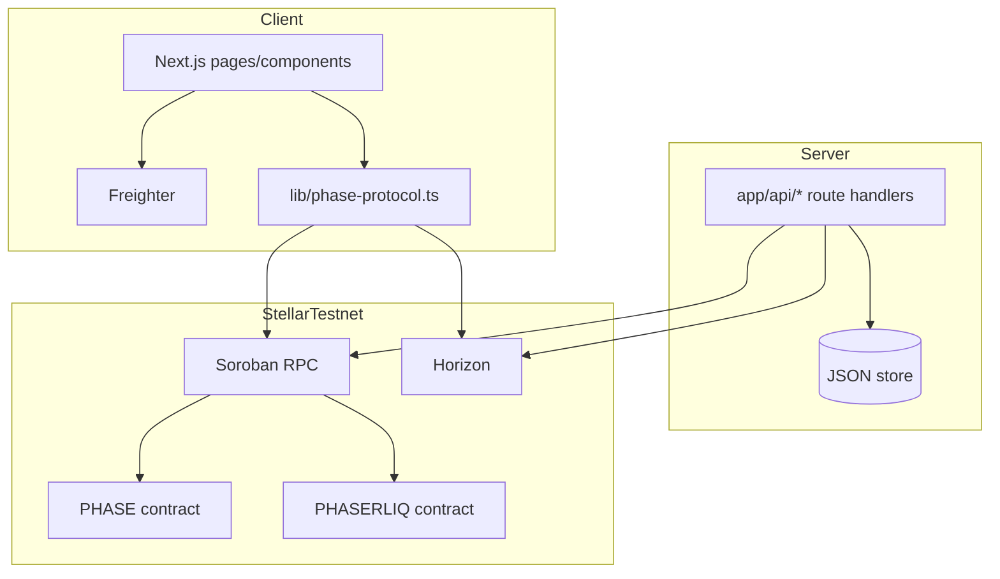

# PHASE Technical Documentation

Professional technical specification for the current repository state.

Primary references:
- [`PROJECT_ARCHITECTURE.md`](../PROJECT_ARCHITECTURE.md)
- [`README.md`](../README.md)
- [`docs/PHASER_LIQ_REWARDS_TERMINAL_DOC.md`](./PHASER_LIQ_REWARDS_TERMINAL_DOC.md)
- [`contracts/README.md`](../contracts/README.md)

---

## 1. System Summary

PHASE is a Next.js + Soroban testnet application where:

- creators register collections;
- users pay PHASERLIQ and mint utility NFTs through settlement;
- rewards/bootstrap APIs support onboarding and testing.

The implementation separates concerns between:

- **Client** (wallet interaction + UI state),
- **Server APIs** (trusted operations and persistence),
- **On-chain contracts** (canonical protocol state).

---

## 2. Runtime Topology



---

## 3. Repository Structure

| Path | Responsibility |
|---|---|
| `app/` | App Router routes, layouts, API handlers, global/tactical styles |
| `components/` | Feature UI components (forge/chamber/rewards/wallet integration) |
| `lib/phase-protocol.ts` | Soroban integration helpers, constants, error normalization |
| `lib/classic-liq.ts` | Classic asset trustline utilities (`changeTrust` XDR, Horizon checks) + CID integrity helpers via `cid-cache` (phase-119) + rate-limit-aware batch submission to Horizon (phase-134) |
| `lib/phase-copy.ts` | Centralized i18n dictionary (EN/ES) |
| `lib/server-data-paths.ts` | Writable data location abstraction |
| `lib/feature-flags.ts` | Flag registry (phase-107,111,113,114 + 116,117,119,120 + 121..124, env resolution, rollback notes) |
| `lib/story-arc-continuity.ts` | AI story-arc continuity check against recent world narratives (phase-107) |
| `lib/narrative-world-store.ts` | World/narrative JSON store + localized per-(tokenId,lang) narrative cache (phase-111) + world export snapshot builder and markdown renderer (phase-112) + collaborative role store with ownership enforcement (phase-109) + lore link store with back-reference index (phase-115) |
| `lib/ipfs-upload-retry.ts` | IPFS upload retry w/ exponential backoff + sha256 checksum (phase-120) |
| `lib/cid-cache.ts` | CID content-addressing cache with integrity verification (phase-119) |
| `lib/cid-verification.ts` | CID multihash verification + `metadata_uri` allowlist; gates the shared-cache lifetime (#229) |
| `lib/viewer-authorization.ts` | Gated-preview grant: token/expiry/`jti`-bound viewer signature, single-use via `viewer_jti` (#227) |
| `lib/security-counters.ts` | Security counter registry (gated preview, CID, wash, distributor) with closed label sets (#227, #229, #230, #231) |
| `lib/wash-screening.ts` | Offer wash screen + volume aggregates excluding wash-flagged offers (#230) |
| `lib/distributor-ledger.ts` | Distributor balance ledger + `BEGIN IMMEDIATE` refill reservation (#231) |
| `lib/ipfs-pinning.ts` | Multi-gateway pinning with quorum + fallback fetch (phase-117) |
| `lib/profile-store.ts` | Profile JSON store + avatar redundancy helpers (phase-117) |
| `lib/contributor-ledger.ts` | Contributor ledger & credit distribution (phase-116) |
| `lib/signal-store.ts` | Signals/replies + attribution ledger wiring (phase-116) + moderation takedown/restore (phase-113) |
| `lib/achievement-store.ts` | Achievement unlocks JSON store + chronological timeline (phase-114) |
| `lib/gateway-health.ts` | Gateway latency scoring + dashboard snapshot (phase-121) |
| `lib/offchain-delta.ts` | Off-chain delta store, hash/stub helpers (phase-122) |
| `lib/ipfs-fallback.ts` / `lib/phase-nft-metadata-build.ts` | IPFS timeout fallback chain, gateway priority ordered by live health score (phase-123) |
| `lib/metadata-migration.ts` | Metadata version migration v1→v2 (phase-124) |
| `lib/wallet-nft-index-cache.ts` | LRU-cached wallet NFT token-id index with stale-on-error fallback (phase-135) |
| `lib/explore-owners-cache.ts` | Cached Explore owner-scan result with stale-on-error fallback (phase-135) |
| `contracts/` | Soroban Rust contracts and tooling docs |
| `docs/` | Technical and operational documentation |

---

## 4. Frontend Routes

| Route | File | Description |
|---|---|---|
| `/` | `app/page.tsx` | Landing page |
| `/forge` | `app/forge/page.tsx` | Collection creation + Oracle flow + rewards |
| `/dashboard` | `app/dashboard/page.tsx` | Market/catalog/listing operations |
| `/chamber` | `app/chamber/page.tsx` | Settlement and artifact interface |
| `/docs` | `app/docs/page.tsx` | In-app product documentation |
| `/.well-known/stellar.toml` | `app/.well-known/stellar.toml/route.ts` | Dynamic SEP-0001 surface |

---

## 5. API Specification

All handlers live in `app/api/**/route.ts`.

### 5.1 Core routes

| Methods | Route | Purpose |
|---|---|---|
| `GET`, `POST` | `/api/faucet` | Reward status + claim execution (server-minted on success). |
| `POST` | `/api/claim-bounty` | Compatibility wrapper over `/api/faucet` with strict typed contract. |
| `GET`, `POST` | `/api/classic-liq` | Classic PHASERLIQ asset status/bootstrap operations. |
| `POST` | `/api/classic-liq/trustline` | Submits user-signed trustline XDR. |
| `POST` | `/api/forge-agent` | Gemini-first forge assistant endpoint with payment gate support. |
| `GET`, `POST` | `/api/nft-listings` | JSON-backed market listing state. |
| `GET`, `PUT` | `/api/artist-profile` | JSON-backed artist alias profile. |
| `GET`, `POST`, etc. | `/api/x402/*` | x402 settlement/verify/supported endpoints. |

The legacy local x402 shim is fail-closed. Set `X402_LOCAL_SHIM_ENABLED=true` only for
local compatibility testing; production payment verification must use the on-chain
settlement verifier and must not accept unsigned base64 payloads.

### 5.2 Response contracts

- `forge-agent` and `claim-bounty` now use strict TypeScript response unions.
- Error payloads are explicit and status-code aligned.
- No untyped `any` responses should be used for public API contracts.
- `POST /api/signals` and `POST /api/signals/[id]/replies` now require a real
  SEP-53 Ed25519 `signature` over `{ title, body, timestamp }` (signals) or
  `{ title: "", body, timestamp }` (replies), plus a numeric `timestamp`. The
  server verifies ownership with `Keypair.fromPublicKey(wallet).verify(...)`
  and returns `400` for missing/invalid/forged signatures. Verified authorship
  is persisted as `signature_verified` and shown as a verified badge in the UI.

### 5.3 Flag-gated API extensions

| Flag | Route | Extension | Flag off |
|------|-------|-----------|----------|
| `phase-109` | `GET /api/world/[collection_id]/roles` | Returns current role map (`editor`/`viewer`) for the world collection | `404` disabled |
| `phase-109` | `POST /api/world/[collection_id]/roles` | Assigns a role to a target wallet; requires `X-Wallet-Signature` header and acting wallet must be the world owner (403 otherwise) | `404` disabled |
| `phase-110` | `GET /api/world/search` | Full-text narrative search across all world collections; supports `?entity=<id>`, `?location=<text>`, `?q=<text>` | `404` disabled |
| `phase-112` | `GET /api/world/[collection_id]/export` | Exports a world snapshot as `json` (default) or `markdown` via `?format=`; responds with `Content-Disposition: attachment` | `404` disabled |
| `phase-115` | `GET /api/world/narrative/[token_id]/links` | Returns `outgoing` and `incoming` lore links for a narrative token | `404` disabled |
| `phase-115` | `POST /api/world/narrative/[token_id]/links` | Creates a directed lore link from `token_id` to a `to_token_id` with an optional `note`; upserts on duplicate | `404` disabled |
| `phase-107` | `POST /api/narrator` | Checks new narrative against the world's recent narratives (Gemini); `409 CONTINUITY_CONTRADICTION` on a detected contradiction | No check, generation always saves |
| `phase-111` | `GET /api/world/narrative/[token_id]` | Reads through a per-(tokenId, `?lang=`) cache with a short TTL | Direct store read every request |
| `phase-113` | `POST /api/signals/[id]/moderate` | Takedown/restore a signal (`x-admin-key` gated); taken-down signals excluded from `GET /api/signals` | `404` disabled, no filtering |
| `phase-114` | `GET /api/achievements` | Adds `timeline` field: achievement unlocks ordered oldest-first with names | Field omitted |
| `phase-116` | `POST/GET /api/signals/[id]/replies` | Narrative contributor attribution: `contributors`, `creditLedger` on reply create; `GET` ledger endpoint with shareBps/roles | `404` disabled, ledger empty |
| `phase-117` | `GET/POST /api/profile/avatar` | Multi-gateway redundancy: `GET` rewrites avatar URL via verified gateway (headers `X-Phase117`), `POST` pins with quorum (`quorum`, `achieved`, `checksum`) | Single gateway, no quorum |
| `phase-119` | `POST/GET /api/classic-liq/trustline` | CID cache + integrity: validates `cid`/`expectedSha256`/`cidPath`, `GET` exposes cache stats, headers `X-Phase119` | Direct submit, no verification |
| `phase-134` | `POST /api/classic-liq/trustline` | Accepts `signedXdrs: string[]` (batch) alongside legacy `signedXdr`; submits with bounded concurrency + 429/503 backoff | Each XDR submits immediately and sequentially, no retry |
| `phase-135` | `GET /api/wallet/phase-nfts` | Serves the wallet's token-id index from an LRU cache when fresh; degrades to stale cached data (not a 503) if every live lookup fails; logs scan duration | No cache; a live-lookup failure propagates as before |
| `phase-135` | `GET /api/explore` | Serves the raw owner-scan result from cache when fresh; degrades to the last-known-good scan (not a 500) if a live scan fails | No cache; a scan failure fails the request as before |
| `phase-120` | `POST /api/ipfs` & `GET /api/og/*` | Upload retry + checksum: `POST /api/ipfs` retries with backoff (`X-Checksum-Sha256`, `X-Phase120-Attempts`), `GET /api/og/*` supports `?pin=1` & reports `X-Phase-Pin-*`, `X-Phase-Og-Template` | Single-shot Pinata, no pin headers |
| `phase-121` | `GET /api/phase-nft/custodian-release` | Gateway health dashboard: sorted gateway list with latency scoring (`score`, `avgLatencyMs`, `uptime`) | `404` disabled |
| `phase-122` | `POST /api/phase-nft/verify` | Adds `delta` + `storage` fields (off-chain manifest, stub note) | Fields omitted |
| `phase-123` | `GET /api/metadata/[id]` & `GET /api/ipfs/[...cid]` | Adds `X-Phase-*` headers, per-gateway timeout, structured `perGateway` error | Legacy 8s sequential, no headers |
| `phase-124` | `scripts/*` | Migration logs, `--migrate-metadata` CLI | No-op with hint |
| `phase-82` | `PATCH /api/signals/[id]` & `GET /api/signals/[id]/history` | Author-only edit with pre-edit version snapshot; `If-Match` is required and stale versions return `409`; history route returns versions + word-level diffs (`diffWords`) | `404` disabled, no edit path |
| `phase-83` | `GET/POST /api/signals/[id]/reactions` | Toggle a curated emoji reaction per (signal, wallet); `GET` returns per-emoji counts + the viewer's own reacted flags; `POST` rate-limited to 20/60s per wallet (`429` + `Retry-After` over the limit) | `404` disabled |
| `phase-139` | `GET/POST /api/market/collections/[collection_id]/offer-book` | `GET` aggregates every pending offer across a collection's active listings into price levels (best price first); `POST` fans a single buyer intent into up to 20 per-listing offers, reporting `created`/`skipped` | `404` disabled; per-listing `/api/market/[id]/offers` unaffected |
| `phase-140` | `POST /api/market/route.ts` (listing create) & `POST /api/market/[id]/offers/[offer_id]` (accept) | Listing create accepts `creator_wallet`/`royalty_bps`; accepting an offer on a secondary sale (`creator_wallet !== seller_wallet`) computes and ledgers a creator/seller split, returned as `royalty` on the accept response | Listing create ignores the fields; accept pays 100% to seller as before |

---

## 6. On-chain Integration

### 6.1 Contract IDs and validation

`lib/phase-protocol.ts` enforces Soroban contract ID validity (`C...`) and rejects classic account IDs (`G...`) where contracts are expected.

Key constants:

- `CONTRACT_ID` (PHASE protocol contract)
- `TOKEN_ADDRESS` (PHASERLIQ contract)
- `RPC_URL`, `HORIZON_URL`, `NETWORK_PASSPHRASE`

### 6.2 Transaction model

- **Read paths**: simulation + retval parsing.
- **Write paths**: unsigned XDR construction -> Freighter signature -> submit + confirmation polling.
- **Error mapping**: protocol-level normalization (including unauthorized gate `#13`).

---

## 7. Rewards and Trustline Model

The reward flow is trustline-first:

1. Query reward state.
2. Ensure classic trustline exists when required.
3. Claim reward via faucet-compatible endpoint.
4. Refresh balances and UI state.

Detailed operational flow is documented in:
[`docs/PHASER_LIQ_REWARDS_TERMINAL_DOC.md`](./PHASER_LIQ_REWARDS_TERMINAL_DOC.md)

---

## 8. Internationalization Rules

- User-facing strings must come from `lib/phase-copy.ts`.
- Components should not hardcode visible text.
- New feature work must include EN/ES keys before merge.

---

## 9. Environment Variables

Canonical reference remains:
[`/.env.local.example`](../.env.local.example)

Critical groups:

- Protocol/token contract IDs (`NEXT_PUBLIC_*`, server-side variants)
- Reward signer (`ADMIN_SECRET_KEY`)
- Classic asset configuration (`CLASSIC_LIQ_*`, `NEXT_PUBLIC_CLASSIC_*`)
- Gemini runtime (`GEMINI_API_KEY`)
- Writable server data directory (`PHASE_SERVER_DATA_DIR`)

### 9.1 Feature flags (phase-88..91, 107,109,110,111,112,113,114 + 115,116..124, 134, 135)

All flags default to **off** (safe rollback). Set to `1`/`true` to enable.

```
# Enable all supported flags (example)
NEXT_PUBLIC_FEATURE_PHASE_88=1
NEXT_PUBLIC_FEATURE_PHASE_89=1
NEXT_PUBLIC_FEATURE_PHASE_90=1
NEXT_PUBLIC_FEATURE_PHASE_91=1
NEXT_PUBLIC_FEATURE_PHASE_107=1
NEXT_PUBLIC_FEATURE_PHASE_109=1
NEXT_PUBLIC_FEATURE_PHASE_110=1
NEXT_PUBLIC_FEATURE_PHASE_111=1
NEXT_PUBLIC_FEATURE_PHASE_112=1
NEXT_PUBLIC_FEATURE_PHASE_113=1
NEXT_PUBLIC_FEATURE_PHASE_114=1
NEXT_PUBLIC_FEATURE_PHASE_115=1
NEXT_PUBLIC_FEATURE_PHASE_116=1
NEXT_PUBLIC_FEATURE_PHASE_117=1
NEXT_PUBLIC_FEATURE_PHASE_119=1
NEXT_PUBLIC_FEATURE_PHASE_120=1
NEXT_PUBLIC_FEATURE_PHASE_121=1
NEXT_PUBLIC_FEATURE_PHASE_122=1
NEXT_PUBLIC_FEATURE_PHASE_123=1
NEXT_PUBLIC_FEATURE_PHASE_124=1
NEXT_PUBLIC_FEATURE_PHASE_134=1
NEXT_PUBLIC_FEATURE_PHASE_135=1
NEXT_PUBLIC_FEATURE_PHASE_82=1
NEXT_PUBLIC_FEATURE_PHASE_83=1
NEXT_PUBLIC_FEATURE_PHASE_139=1
NEXT_PUBLIC_FEATURE_PHASE_140=1
# Server-only aliases also accepted: FEATURE_PHASE_104, etc.
```

Rollback: unset the var or set `0` and restart. No ledger migration to revert; off-chain stores remain but are ignored when flag off. See `PROJECT_ARCHITECTURE.md` §10.

---

## 10. Security and Operations

- Never commit private credentials.
- Keep server-only secrets out of client runtime.
- Use writable server storage abstraction (`server-data-paths`) for platform-safe behavior.
- On contract redeploys, update:
  - env values,
  - architecture/technical docs,
  - any static references.

---

## 11. Build and Verification

```bash
npm install
npm run dev
npm run build
npx tsc --noEmit
```

Contract commands are documented in [`contracts/README.md`](../contracts/README.md).

### 11.1 CI/CD

`.github/workflows/ci.yml` runs on every PR and push to `main`:

- `contracts` — compiles and tests both Soroban crates (`mock-token`, `phase-protocol`) against `wasm32-unknown-unknown`.
- `web` — `npm run lint`, `npm run typecheck` (both currently non-blocking pending a cleanup of pre-existing errors — see the job for the tracked count), and `npm run build`.
- `deploy-staging` — on push to `main` only, behind a `staging` GitHub environment: builds + optimizes `phase-protocol` and runs `scripts/deploy-phase-sep50.ts` against testnet using repo secrets/vars.

---

## 12. External References

- [Soroban Smart Contracts](https://developers.stellar.org/docs/build/smart-contracts)
- [SEP-0001](https://github.com/stellar/stellar-protocol/blob/master/ecosystem/sep-0001.md)
- [Freighter Docs](https://docs.freighter.app/)
- [Stellar x402](https://developers.stellar.org/docs/build/agentic-payments/x402)

---

## 13. Gated content, CID verification and market integrity

Three security properties that interact, and are easy to get individually right
and collectively wrong. Findings and measurements are in `docs/spikes/`.

### Gated preview authorization (#227)

```
signedPayload = SHA256("Phase SEP50" | networkPassphrase | contractId |
                       viewer | tokenId | exp | jti)
signedBytes   = "Stellar Signed Message:\n" + "phase-viewer:v1:" + hex(signedPayload)
```

Every field is inside the digest, so none can be swapped after signing:
`networkPassphrase` blocks cross-network replay, `contractId` blocks
cross-contract replay, `tokenId` blocks one signature opening every gated token,
`exp` bounds the window to 300s (±30s skew), and `jti` makes each signature
single-use.

`jti` is consumed with `INSERT … ON CONFLICT (jti) DO NOTHING` against
`viewer_jti`. The primary key does the work, so two concurrent presentations
cannot both win — a read-then-write in the request path would let exactly that
race through. The `jti` is consumed **after** the signature verifies, so a
signature that fails verification is not burned.

**The signature lifetime is not the security boundary — the cache layer is.** A
300-second `exp` on a response marked `public, s-maxage=31536000` is still a
year-long bearer token. Gated responses are therefore `private, no-store` with
`Vary: Authorization`.

`POST /api/phase-nft/verify` returns `gatedVerified: false` when no signature is
present. Default-deny: gated content stays gated when the signature path is
absent or broken.

### CID verification (#229)

`cid-cache.ts` verifies cached bytes against a **stored** digest, which catches
corruption but not a client-supplied CID — an attacker who supplies both the CID
and the payload satisfies that check, because the stored digest was computed
from the attacker's own bytes. `verifyCID` recomputes the digest **from the CID
itself**:

| Input | Result |
|---|---|
| CIDv0 `Qm…` | base58btc, multihash `0x12 0x20`, recompute sha2-256 |
| CIDv1 `bafy…` | base32, sha2-256 length 32, recompute sha2-256 |
| CIDv1 `bafb…` (blake2b) | `CID_UNVERIFIABLE` — **not** recomputable, so not passed |
| digest ≠ payload | `CID_MISMATCH` → 400, never cached |

`metadata_uri` is allowlisted to `ipfs://` with a verifiable CID; `https://` is
refused outright because it is not content-addressed. Rejection happens in the
route **before** any fetch.

Cache lifetime follows verification:

| State | `Cache-Control` |
|---|---|
| verified, non-gated | `public, …, s-maxage=31536000, immutable, Vary: Authorization` |
| gated | `private, max-age=60, Vary: Authorization` |
| unverified / mismatch | `private, no-store, Vary: Authorization` |

### Wash screening and volume (#230)

The detectors in `lib/wash-trading.ts` are now consulted on the **write** path.
Policy is deliberately asymmetric:

| Pattern | Action |
|---|---|
| `buyer == seller` | **400 block** — no legitimate reading of bidding on your own listing |
| circular, rapid flip, sybil cluster | **flag**, excluded from volume |

Blocking the graph-based patterns would reject ordinary wallets funded from the
same exchange. The damage is the offer *counting toward volume*, not the offer
existing, so flagged offers are created and excluded from every volume
aggregate. Screening is O(1) per offer plus a bounded (≤200 row) window read,
so a 100k-offer campaign cannot amplify the check into an outage.

### Distributor refill reservation (#231)

The refill path was a check-then-act race: read the balance, decide it is low,
submit. Two concurrent refills both read the same balance and both submitted.
`reserveFunds` performs the check and the hold in one `BEGIN IMMEDIATE`
transaction — `IMMEDIATE` takes the write lock *before* the first read, which a
deferred `BEGIN` would not.

```
availableBalance = balance - reserve - feeReserve - pendingReserved
```

The fee reserve is separate from the trustline reserve: fees come out of native
XLM, and draining it below the transaction fee strands every later settlement.
A failed refill **must** release its hold; a refill still pending after the poll
window **keeps** it, since releasing it would let a concurrent refill authorise
against funds the pending transaction is about to consume.
